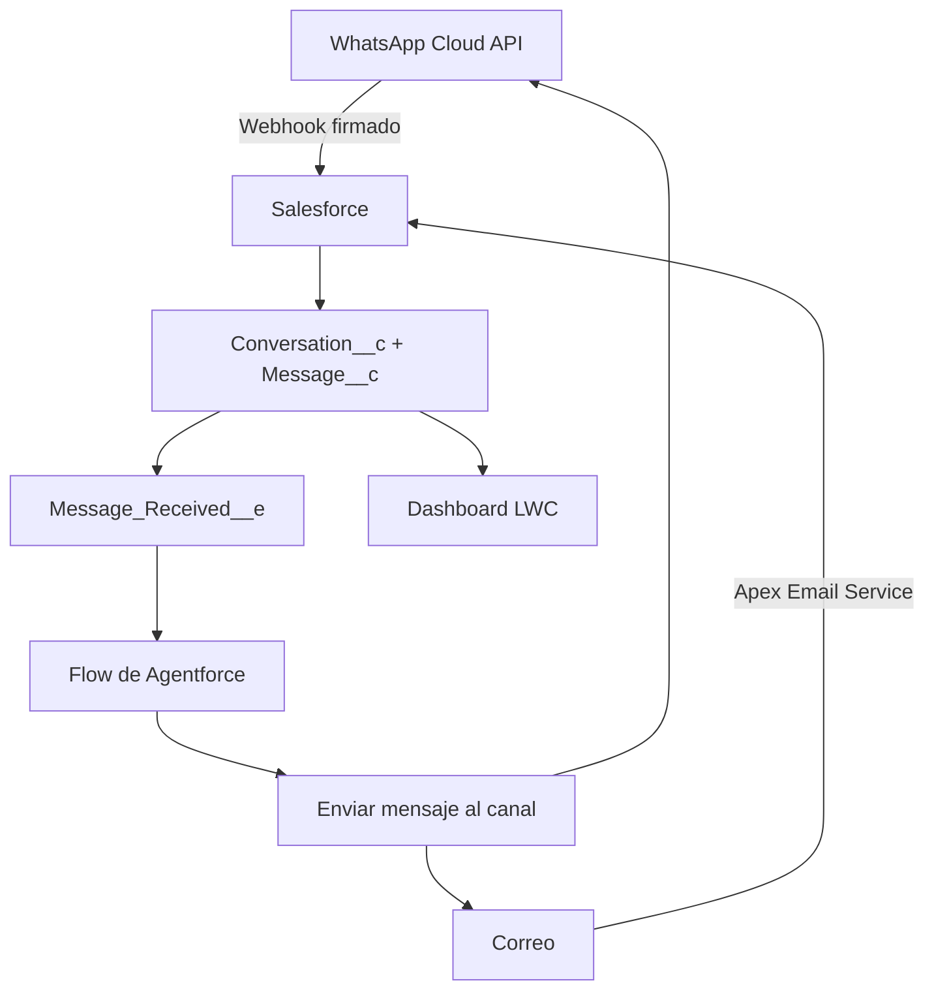

# Integración de WhatsApp, correo y Agentforce

Esta rama agrega mensajería real al panel sin modificar `AdvisorDashboardController` ni los metadatos de `Lead`. Los cambios de Leads del otro integrante se pueden fusionar por separado.

## Qué queda implementado



- WhatsApp entrante mediante webhook con validación `X-Hub-Signature-256`.
- WhatsApp saliente mediante Cloud API y Named Credential.
- Correo entrante mediante Apex Email Service.
- Correo saliente mediante `Messaging.sendEmail` y una dirección organizacional verificada.
- Identificador externo para evitar procesar dos veces el mismo mensaje.
- Estados `Sent`, `Delivered`, `Read` y `Failed` actualizados desde Meta.
- Caja de respuesta en el chat y actualización automática cada cinco segundos, también compatible con móvil.
- Evento `Message_Received__e` para conectar cada mensaje nuevo con Agentforce sin acoplar el webhook al agente.
- Acción invocable `Enviar mensaje al canal` para que un Flow envíe la respuesta de Agentforce.

## 1. Desplegar la rama

Desde la raíz del proyecto:

```powershell
sf project deploy start --source-dir force-app --target-org AsesorSegurosDash
sf org assign permset --name AdvisorDashboard --target-org AsesorSegurosDash
```

Ejecuta las pruebas Apex después del despliegue:

```powershell
sf apex run test --tests ConversationMessagingServiceTest --tests WhatsAppWebhookControllerTest --result-format human --wait 20 --target-org AsesorSegurosDash
```

## 2. Configurar WhatsApp Cloud API

### En Meta

1. Crea o abre la aplicación en Meta for Developers.
2. Agrega el producto **WhatsApp** y entra en **API Setup**.
3. Para la demo puedes usar el número de prueba y agregar los teléfonos del equipo como destinatarios permitidos.
4. Copia estos valores:
   - Phone Number ID.
   - App Secret de la aplicación.
   - Access token. Para una demo rápida sirve el temporal; para una integración estable usa un system-user token.
5. Genera una cadena aleatoria que será el verify token.

No guardes el access token en Apex, GitHub, Custom Metadata ni archivos locales versionados.

### En Salesforce: credencial segura

1. En **Setup → Named Credentials → External Credentials**, crea una External Credential con protocolo **Custom**.
2. Agrega un principal nombrado y un parámetro de autenticación llamado `accessToken`; coloca ahí el token de Meta.
3. Agrega un custom header `Authorization` cuyo valor sea `Bearer ` seguido del parámetro seguro de la credencial.
4. Concede acceso al principal al permission set **Advisor Dashboard**.
5. Crea una Named Credential:
   - API Name: `WhatsApp_Graph`
   - URL: `https://graph.facebook.com`
   - External Credential: la creada en los pasos anteriores.

Salesforce recomienda Named/External Credentials porque los tokens quedan cifrados y no se exponen a Apex.

### En Salesforce: configuración del canal

1. Ve a **Setup → Custom Metadata Types → Messaging Setting → Manage Records → Default**.
2. Establece:
   - WhatsApp Enabled: activado.
   - WhatsApp Named Credential: `WhatsApp_Graph`.
   - WhatsApp Graph Version: la versión vigente elegida en Meta, por ejemplo `v24.0`.
   - WhatsApp Phone Number ID: el ID copiado de Meta.
   - Require Webhook Signature: activado.
   - Auto Create Leads: déjalo desactivado mientras tu compañero trabaja en Leads.
3. Ve a **Setup → Custom Settings → Messaging Secrets → Manage** y crea los valores predeterminados de la organización:
   - WhatsApp Verify Token: la cadena que tú inventaste.
   - WhatsApp App Secret: el App Secret de Meta.

Estos dos secretos se configuran directamente en el org y no se incluyen en el repositorio.

### Publicar el webhook

Meta necesita una URL HTTPS pública. Usa el Experience Cloud site o Salesforce Site del proyecto:

1. Abre el perfil del usuario invitado del sitio.
2. En **Enabled Apex Class Access**, habilita `WhatsAppWebhookController`.
3. La URL de callback termina en:

```text
/services/apexrest/messaging/whatsapp
```

Ejemplo con prefijo del sitio:

```text
https://tu-dominio.my.site.com/tu-sitio/services/apexrest/messaging/whatsapp
```

4. En **Meta App Dashboard → WhatsApp → Configuration → Webhook**:
   - Callback URL: la URL anterior.
   - Verify token: exactamente el configurado en `Messaging Secrets`.
   - Suscribe el campo `messages`.

El `GET` devuelve el `hub.challenge`; los `POST` solo se aceptan cuando su firma HMAC coincide con el App Secret.

### Prueba mínima de WhatsApp

1. En el Lead de prueba, guarda el teléfono con código de país, por ejemplo `+52...`.
2. Desde ese teléfono envía un WhatsApp al número de prueba de Meta.
3. Deben crearse o actualizarse `Conversation__c` y `Message__c`.
4. Abre el panel, entra a **Conversaciones** y responde desde la caja inferior.
5. Meta solo permite texto libre dentro de la ventana de atención de 24 horas. Fuera de esa ventana se necesita una plantilla aprobada; el panel mostrará el motivo en rojo en vez de fingir que el mensaje salió.

## 3. Configurar correo

### Dirección de salida

1. Ve a **Setup → Organization-Wide Addresses**.
2. Crea y verifica una dirección del equipo, por ejemplo `asesoria@...`.
3. En **Deliverability**, selecciona **All Email** para la demo.

### Dirección de entrada

1. Ve a **Setup → Email Services** y crea un servicio activo.
2. Apex Class: `InboundEmailChannelHandler`.
3. Crea una dirección para el servicio y copia la dirección larga generada por Salesforce.
4. En el registro `Messaging Setting.Default`, configura:
   - Email Enabled: activado.
   - Email Service Address: la dirección generada.
   - Email From Address: la dirección organizacional verificada.
   - Default Email Subject: el asunto predeterminado.

Puedes usar directamente la dirección generada durante la demo o configurar un reenvío desde un buzón más presentable. Las respuestas conservan un token `[DASH:<ConversationId>]` en el asunto, con el que Salesforce las asocia a la conversación correcta.

### Prueba mínima de correo

1. Un Lead de prueba debe tener `Email` informado.
2. Envía un correo a la dirección del Email Service.
3. Abre el panel y verifica que aparezca como mensaje entrante del canal `Email`.
4. Responde desde el chat; el destinatario recibirá el correo desde la dirección organizacional y su respuesta volverá al Email Service.

## 4. Conectar los mensajes con Agentforce

La integración publica `Message_Received__e` después de guardar cada mensaje entrante. El Flow debe ser asíncrono para que el webhook responda rápido a Meta.

1. Crea un **Platform Event-Triggered Flow** sobre `Message Received`.
2. En las opciones avanzadas de **Start**, elige ejecutar como **Default Workflow User**. Usa un usuario de integración o administrador al que hayas asignado **Advisor Dashboard** y el principal de la External Credential; así el envío asíncrono puede usar la credencial de Meta.
3. Agrega **Get Records** para recuperar `Conversation__c` usando `$Record.Conversation_Id__c`.
4. Agrega una decisión:
   - `Status__c = Bot`: continúa con Agentforce.
   - `Status__c = Human`: termina; el asesor ya tomó la conversación.
5. En **Action**, busca la categoría **AI Agent Actions** y selecciona **Run Agent** con el agente activado del proyecto.
6. Usa `$Record.Body__c` como mensaje del usuario. Pasa también el canal y el identificador de conversación si la acción muestra entradas de contexto.
7. Después de obtener la respuesta del agente, agrega la acción Apex **Enviar mensaje al canal**:
   - Conversation ID: `$Record.Conversation_Id__c`.
   - Message: texto final devuelto por Agentforce.
   - Sender Type: `Agentforce`.
8. Si el topic de escalación marca `Needs_Human_Attention__c`, conserva ese Flow: el dashboard ya muestra la alerta y deja de responder automáticamente cuando la conversación pasa a `Human`.

Si el org no muestra **Run Agent**, usa las acciones estándar **Start Session** y **Send Message** de AI Agent API. Guarda el session ID en `Conversation__c.Agent_Session_ID__c` y aumenta `Agent_Sequence__c` en cada turno.

## 5. Canal adicional recomendado

Para el hackatón, el tercer canal con mejor relación impacto/tiempo es **Web Chat** en Experience Cloud: reutiliza Agentforce, no necesita otro proveedor y puede escribir en los mismos objetos. Después, el adaptador más sencillo es SMS con Twilio. Alexa conviene dejarla como evolución porque requiere una Alexa Skill, AWS Lambda, vinculación de cuenta y otra capa de pruebas.

## Checklist de la demo

- [ ] WhatsApp entrante crea un `Message__c` una sola vez.
- [ ] El panel refleja el mensaje en menos de cinco segundos.
- [ ] Agentforce responde y la respuesta llega a WhatsApp.
- [ ] `delivered` y `read` se reflejan en el mensaje.
- [ ] Correo entrante aparece en la misma bandeja.
- [ ] Responder un correo desde el panel mantiene el hilo.
- [ ] “Tomar conversación” detiene la respuesta automática del Flow.
- [ ] Ningún token aparece en GitHub ni en archivos del proyecto.

## Documentación oficial

- [WhatsApp Cloud API: primeros pasos](https://developers.facebook.com/documentation/business-messaging/whatsapp/get-started)
- [WhatsApp Webhooks](https://developers.facebook.com/documentation/business-messaging/whatsapp/webhooks/overview)
- [WhatsApp Message API](https://developers.facebook.com/documentation/business-messaging/whatsapp/reference/whatsapp-business-phone-number/message-api)
- [Salesforce Named Credentials](https://developer.salesforce.com/docs/platform/named-credentials/guide/get-started.html)
- [Salesforce Apex Email Services](https://developer.salesforce.com/docs/atlas.en-us.apexcode.meta/apexcode/apex_classes_email_inbound_what_is.htm)
- [Agentforce Agent API](https://developer.salesforce.com/docs/ai/agentforce/references/agent-api)
